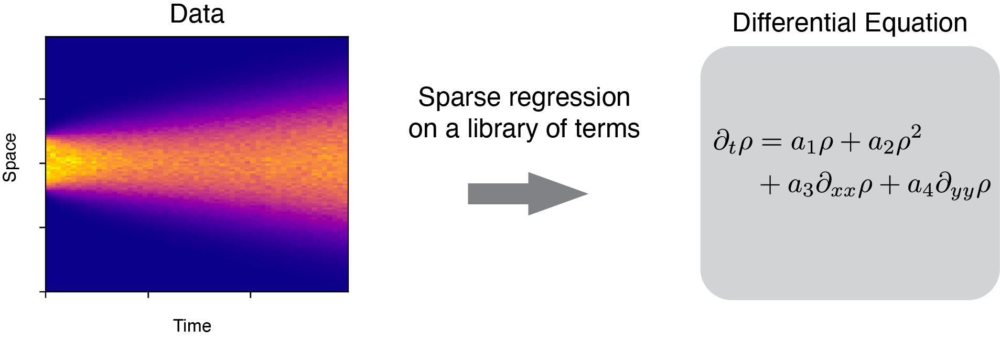

## Learning PDEs from data 

This repo contains the module `pdel` (short for PDE learning) that I have implemented based on recently proposed methods in sparse regression([Brunton et al., 2016](https://www.pnas.org/content/113/15/3932), [Rudy et al., 2017](https://advances.sciencemag.org/content/3/4/e1602614)) and stability selection ([Maddu et al., 2019](https://arxiv.org/abs/1907.07810)) to learn dynamical equations from data.

The goal of these methods is to infer ordinary/partial differential equations from time-series measurement data. 




If you would like to use the code locally, clone the repo and navigate to the code directory.

```
git clone https://github.com/rohitsupekar/learn-PDEs-from-data
cd learn-PDEs-from-data
```

## Install the dependencies:

(Using conda) Create a new environment
```
conda env create --name pdel --file=environment.yml
conda activate pdel
```
(Using pip) 
```
pip3 install -r requirements.txt
```

We use `joblib` for parallelization and `sklearn` for cross-validation-specific needs. 

## Implementations 

`pdel.pdelearn` has the core framework of generating library functions, cross-validation, and stability selection. 

`pdel.funcs` provides helper functions. 

`pdel.solvers` provides solvers for sparse regression. 

## Example

Please check `example.ipynb` which describes using the module on simulated data from the Fisher-KPP equations. 
